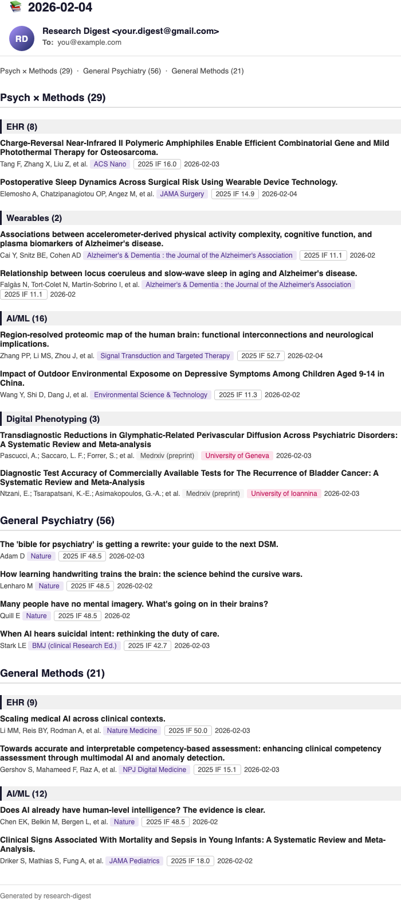

# Research Digest

One HTML email at 8am with new PubMed papers, preprints, and NIH grants — filtered to your research focus, delivered by GitHub Actions cron. Free, self-hosted, no SaaS account.

> **This is a template.** It ships with psychiatry + clinical informatics defaults, but the structure is domain-agnostic. Fork it, then swap in your own topic, methods, keywords, and journal whitelists. See [Customization](#customization) for how.

📖 **For the design rationale** (why 3 daily sections + 2 weekly, why bioRxiv uses AND but medRxiv uses OR, etc.): see [DESIGN.md](DESIGN.md).



---

## Overview

```
📬 Research Digest
│
├── 📊 Daily Sections
│   │
│   ├── 1. Psych × Methods ────────────────── Core intersection
│   │   ├── EHR ──────────────────────── PubMed + Preprints
│   │   ├── Wearables ───────────────── PubMed + Preprints
│   │   ├── AI / ML ──────────────────── PubMed + Preprints
│   │   └── Digital Phenotyping ─────── PubMed + Preprints
│   │
│   ├── 2. General Psychiatry ─────────────────── No subsections
│   │   └── (flat list, no preprints)
│   │
│   └── 3. General Methods ─────────────────── Methods only, no Psych filter
│       ├── EHR ──────────────────────── PubMed only
│       ├── Wearables ───────────────── PubMed only
│       ├── AI / ML ──────────────────── PubMed only
│       └── Digital Phenotyping ─────── PubMed only
│
└── 📅 Weekly Sections (Sunday)
    │
    ├── Research Databases ──────────────── Papers using specific databases
    │   ├── ABCD Study ──────────────── PubMed + Preprints
    │   ├── Epic Cosmos ─────────────── PubMed + Preprints
    │   └── All of Us ───────────────── PubMed + Preprints
    │
    └── NIH RePORTER ───────────────────── Newly funded grants
        └── Institute filter ∪ Methods keywords
```

*Section names reflect the default template. Rename freely — e.g., "Psych × Methods" → "Cardio × Methods" or "Oncology × Methods". See [Customization](#customization).*

- **Daily volume**: typically 20-60 papers total, triaged by reading titles and journal tags.
- **Deduplication**: across sources (DOI + fuzzy title), across sections (higher-priority section wins), across a 7-day window.
- **Sources**: PubMed, medRxiv, bioRxiv, arXiv, NIH RePORTER.
- **Tags in email**: journal (color-coded), impact factor (if configured), institution, grant activity code.

---

## Setup prerequisites

You will need:

| Component | Why | Account needed |
|-----------|-----|----------------|
| GitHub account | Hosts the repo and runs the cron via Actions | Yes |
| Gmail account (with 2-Step Verification) | Sends the daily email via SMTP; app password needed | Yes |
| NCBI account → API key | Raises PubMed rate limit (recommended, not strictly required) | Yes (free) |
| Destination email | Where the digest is delivered (can be the same Gmail or another inbox) | — |

These data sources are queried via **public APIs** and need no account or key: arXiv, medRxiv / bioRxiv, NIH RePORTER.

---

## Install

Two paths, depending on how you like to work:

### 🤖 Path A — Claude Code skill (recommended, ~5 min, conversational)

If you use [Claude Code](https://claude.com/claude-code), this repo ships a companion setup skill that walks you through everything in plain English — research context, forking, secrets, test run. No manual config editing required.

```bash
# One-time install
git clone https://github.com/shaexys/research-digest.git
ln -s $(pwd)/research-digest/.claude/skills/research-digest-setup ~/.claude/skills/research-digest-setup
```

Then in Claude Code:

```
/research-digest-setup
```

The skill handles: asking about your research focus, generating your `config.py`, forking this repo to your account, setting GitHub Actions secrets via `gh` CLI, and triggering the first test run. Designed for researchers who want results without editing Python.

### 🛠 Path B — Fork + configure manually (~10 min)

If you're comfortable with GitHub and Python, and want full control:

1. Click **"Use this template"** at the top of this repo → create your own copy.
2. Edit `src/config.py`:
   - Replace the domain module (`PSYCH`) with your topic keywords. See [Customization § Domain](#domain).
   - Edit or rename method modules to match your interests.
   - Adjust journal whitelists for your field.
   - Optional: populate `_ISSN_LIST` for Section 1 breadth (see [DESIGN.md § ISSN Whitelist](DESIGN.md#issn-whitelist)).
3. Get a Gmail app password: Google Account → Security → 2-Step Verification → App passwords → generate.
4. Get an NCBI API key at https://account.ncbi.nlm.nih.gov/settings/ → API Key Management.
5. In your fork → Settings → Secrets and variables → Actions → add 4 repository secrets:
   - `GMAIL_USER` — your sending Gmail address
   - `GMAIL_APP_PASSWORD` — the app password from step 3
   - `EMAIL_TO` — where you want the digest delivered
   - `NCBI_API_KEY` — from step 4
6. Actions tab → **Research Digest** workflow → "Run workflow" (manual trigger) to test.
7. Check your inbox. Daily runs at 8am EST thereafter.

---

## Customization

Customization covers three axes: what your **domain** is, what **methods** you follow, and **other** pipeline behavior (schedule, databases, etc.).

You don't need to add anything new to customize — most users just **rename and edit** what's already there.

### Domain

**Change the topic the digest tracks.** The default is psychiatry; adapt to your field.

- **Keywords module:** rewrite `PSYCH` in `src/config.py` with your domain's MeSH + free-text terms. Rename the variable if you like (e.g., `PSYCH` → `CARDIO` / `NEURO` / `ONCO`). Update references in `ALERTS`.
- **Top-tier domain journals:** edit `JOURNAL_TOP_PSYCH` with your field's leading journals. Rename the variable (e.g., `JOURNAL_TOP_CARDIO`). Update references in `_ALL_JOURNALS` and `ALERTS`.
- **General-medical journals (`JOURNAL_TOP_MED`):** most default entries (JAMA, Lancet, NEJM, BMJ, Nature Medicine) stay relevant across fields. Edit if your field has different "general" outlets.
- **Clinical informatics journals (`JOURNAL_CLINICAL_INFORMATICS`):** keep if you care about informatics / AI methodology papers regardless of domain; remove if not.

### Methods

**Adjust which methodological lenses the pipeline tracks.** Each method is a subsection in Section 1 and Section 3.

- **Edit an existing method.** Each module (`EHR_METHODS`, `WEARABLES_METHODS`, `AI_METHODS`, `DIGITAL_PHENOTYPING_METHODS`) is just a keyword list. Tweak the terms directly — add, remove, or replace keywords.
- **Remove a method you don't need.** Delete the module plus its entries in `METHODS_SUBSECTIONS` and `ALERTS`. The pipeline works with any number of method subsections (1 minimum).
- **Add a new method.** Create a new module, e.g.:
    ```python
    CAUSAL_METHODS = (
        '"Causal Inference"[MeSH] OR '
        '"instrumental variable*"[tiab] OR '
        '"propensity score"[tiab] OR ...'
    )
    ```
    Then reference it in `METHODS_SUBSECTIONS` and `ALERTS`.
- **Rename a method.** Same idea as domain — find and replace, update references.

### Other

**Schedule, databases, and section toggles.**

- **Change delivery time.** Edit `.github/workflows/daily.yml`:
    ```yaml
    on:
      schedule:
        - cron: '0 13 * * *'  # 8am EST / 1pm UTC — cron uses UTC
    ```
- **Research Databases (weekly section).** Edit `DB_ABCD` / `DB_EPIC_COSMOS` / `DB_ALL_OF_US` in `src/config.py`, `DATABASE_KEYWORDS`, and `ALERTS`. Keep queries specific (full database name in quotes).
- **NIH RePORTER institute filter.** `src/reporter.py` currently filters for NIMH. Change `agencies=["NIMH"]` to your funding agencies of interest (NHLBI, NCI, NIA, etc.).
- **Disable a section entirely.** Remove the corresponding entries from `ALERTS`. For instance, remove all Section 2 entries if you don't want the general-domain section; remove the Sunday-only entries if you want daily only.

The two-layer design (see [DESIGN.md § Two-layer module structure](DESIGN.md#1-two-layer-module-structure)) means customization never touches API code in `src/pubmed.py` / `src/medrxiv.py` / etc. — only `config.py` and occasionally `reporter.py`.

---

## Optional: Impact Factor tags

The pipeline can render a per-journal **Impact Factor** tag in the email. This requires Clarivate JCR data, which JCR's terms of service prohibit redistributing — so this template ships without it.

**You do not need IF tags for the pipeline to work.** If you skip this step, the email still renders correctly; IF tags simply won't appear.

If you want IF tags and have institutional JCR access: see [DESIGN.md § ISSN Whitelist](DESIGN.md#issn-whitelist) for how to generate `data/jif_lookup.json` locally. This file is `.gitignore`d — do not commit it. The same applies to any custom `_ISSN_LIST` you add to `src/config.py`.

---

## Limits and known issues

- **TOC anchor links in the email don't work in some clients** (notably Outlook web and Gmail web). The browser version works fine if you "view in browser" or receive in Apple Mail. See [DESIGN.md § Email Design Rationale](DESIGN.md).
- **arXiv preprints** are filtered locally because the API doesn't support date-range + category + keyword in combination. A busy day can pull a lot of arXiv papers before filtering.
- **No historical backfill.** On first run you get today's papers; earlier days are not retroactively indexed.

---

## License

MIT. See [LICENSE](LICENSE).

## Acknowledgments

Built to solve a personal morning-coffee problem. If it solves yours too, fork away — and consider sharing what you customize.

For the design rationale behind every choice, read [DESIGN.md](DESIGN.md).
