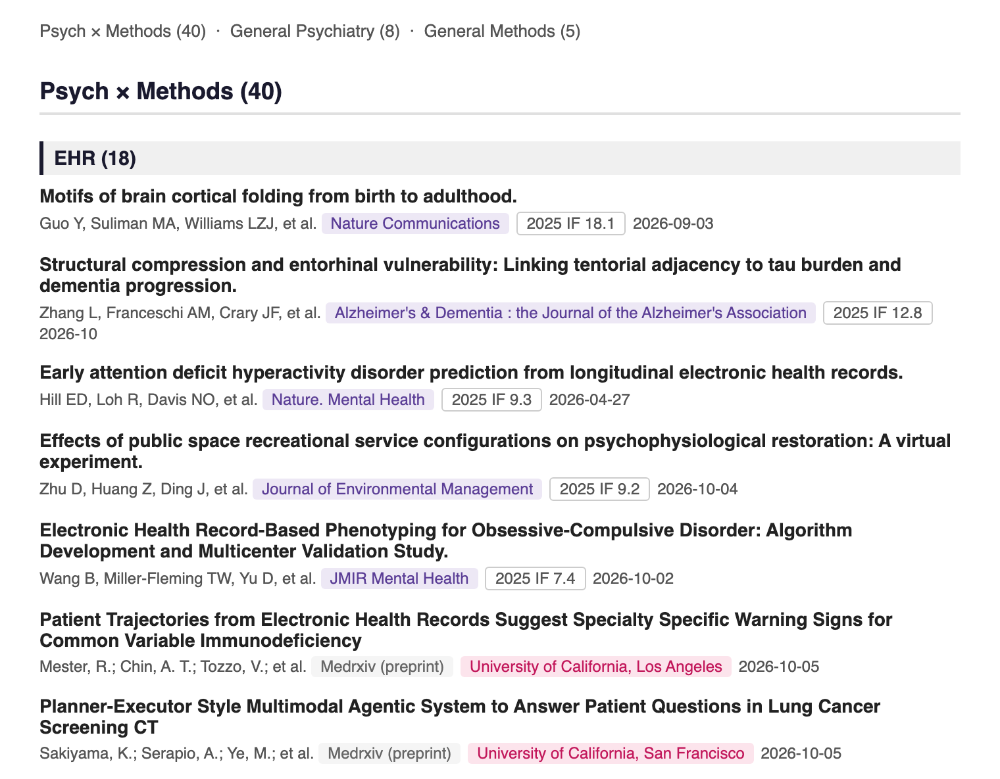

# Research Digest

Daily PubMed papers and preprints at 7am US Eastern, plus weekly NIH grants and database-cohort papers on Sundays, delivered as one HTML email filtered to your research focus. It runs on a GitHub Actions schedule, so it is free and needs no third-party account.

> **This is a template.** It ships with psychiatry and clinical informatics defaults, but the structure is domain-agnostic: fork it and replace the topic, methods, keywords and journal lists with your own (see [Customization](#customization)).

The rationale for each design choice, such as three daily and two weekly sections or AND matching for bioRxiv but OR for medRxiv, is in [DESIGN.md](DESIGN.md).

<p align="center">
  
</p>

---

## Overview

```
📬 Research Digest
│
├── 📊 Daily Sections
│   │
│   ├── 1. Psych × Methods ────────────────── Core intersection
│   │   ├── EHR ──────────────────────── PubMed + Preprints
│   │   ├── Wearables ───────────────── PubMed + Preprints
│   │   ├── AI / ML ──────────────────── PubMed + Preprints
│   │   └── Digital Phenotyping ─────── PubMed + Preprints
│   │
│   ├── 2. General Psychiatry ─────────────────── No subsections
│   │   └── (flat list, no preprints)
│   │
│   └── 3. General Methods ─────────────────── Methods only, no Psych filter
│       ├── EHR ──────────────────────── PubMed only
│       ├── Wearables ───────────────── PubMed only
│       ├── AI / ML ──────────────────── PubMed only
│       └── Digital Phenotyping ─────── PubMed only
│
└── 📅 Weekly Sections (Sunday)
    │
    ├── Research Databases ──────────────── Papers using specific databases
    │   ├── ABCD Study ──────────────── PubMed + Preprints
    │   ├── Epic Cosmos ─────────────── PubMed + Preprints
    │   └── All of Us ───────────────── PubMed + Preprints
    │
    └── NIH RePORTER ───────────────────── New and competing-renewal awards
        └── NIMH (all) ∪ Topic keywords ∪ Methods keywords
```

Section names reflect the default template and can be renamed, such as "Psych × Methods" to "Cardio × Methods".

- **Daily volume**: typically 20 to 60 papers, triaged by title and journal tags.
- **Deduplication**: across the four literature feeds (DOI + fuzzy title), across sections (higher-priority section wins), and across a 7-day window.
- **Sources**: PubMed, medRxiv, bioRxiv, arXiv, NIH RePORTER.
- **Tags in email**: journal (color-coded), impact factor (if configured, see [Optional: Impact Factor tags](#optional-impact-factor-tags)), institution for preprints, grant activity code.

### How sections are built

Every section is assembled from two kinds of keyword modules in `src/config.py`: one **topic** module (`PSYCH`) and several **method** modules (`EHR_METHODS`, `WEARABLES_METHODS`, `AI_METHODS`, `DIGITAL_PHENOTYPING_METHODS`).

| Section | Query shape | Journal filter |
|---|---|---|
| 1. Psych × Methods | topic AND method, one subsection per method module | curated journal lists, widened by an ISSN whitelist if configured |
| 2. General Psychiatry | topic alone | top psychiatry journals, plus topic-matched papers in general-medical and informatics journals |
| 3. General Methods | method alone | general-medical and informatics journals |

Filter strictness differs by evidence level: peer-reviewed papers pass through journal lists, while preprints are matched on keywords and tagged with the corresponding author's institution as a quality cue. Replacing one module updates every section that uses it, so moving the template to another field means editing modules, not queries.

---

## Setup prerequisites

You will need:

| Component | Why | Account needed |
|-----------|-----|----------------|
| GitHub account | Hosts the repo and runs the schedule through Actions | Yes |
| Gmail account (with 2-Step Verification) | Sends the daily email via SMTP; app password needed | Yes |
| NCBI API key | Raises the PubMed rate limit (recommended, not required) | Yes (free) |
| Destination email | Where the digest is delivered (the same Gmail or another inbox) | No |

arXiv, medRxiv, bioRxiv and NIH RePORTER are queried through public APIs and need no account or key.

---

## Install

### Path A: Claude Code skill (recommended, about 5 minutes)

If you use [Claude Code](https://claude.com/claude-code), the companion setup skill in this repo walks you through research context, forking, secrets and a test run, with no manual config editing.

```bash
# One-time install
git clone https://github.com/shaexys/research-digest.git
ln -s $(pwd)/research-digest/.claude/skills/research-digest-setup ~/.claude/skills/research-digest-setup
```

Then in Claude Code:

```
/research-digest-setup
```

The skill asks about your research focus, generates `config.py`, forks this repo to your account, sets the GitHub Actions secrets with the `gh` CLI and triggers the first test run.

### Path B: fork and configure manually (about 10 minutes)

1. Click **Use this template** at the top of this repo to create your own copy.
2. Edit `src/config.py`:
   - Replace the domain module (`PSYCH`) with your topic keywords. See [Customization § Domain](#domain).
   - Edit or rename method modules to match your interests.
   - Adjust journal whitelists for your field.
   - Optional: populate `_ISSN_LIST` to widen Section 1 (see [DESIGN.md § ISSN Whitelist](DESIGN.md#issn-whitelist)).
3. Create a Gmail app password: Google Account → Security → 2-Step Verification → App passwords.
4. Create an NCBI API key at https://account.ncbi.nlm.nih.gov/settings/ under API Key Management.
5. In your fork, open Settings → Secrets and variables → Actions and add four repository secrets:
   - `GMAIL_USER`: the sending Gmail address
   - `GMAIL_APP_PASSWORD`: the app password from step 3
   - `EMAIL_TO`: where the digest is delivered
   - `NCBI_API_KEY`: the key from step 4

   Optional: `ISSN_WHITELIST` (pipe-separated ISSNs that widen Section 1 beyond the curated journal lists) and `JIF_LOOKUP_GZ_1` … `JIF_LOOKUP_GZ_8` (impact-factor tags; see [Optional: Impact Factor tags](#optional-impact-factor-tags)).
6. In the Actions tab, open the **Research Digest** workflow and click **Run workflow** to test.
7. Check your inbox. Daily runs start at 11:00 UTC (7am EDT, 6am EST), with a backup run at 11:30 UTC in case GitHub drops the first; already-sent papers are skipped.

---

## Customization

Customization covers three axes: your **domain**, the **methods** you follow, and **other** pipeline behavior such as schedule and databases. Most changes are renames and edits of existing modules.

### Domain

- **Keywords module:** rewrite `PSYCH` in `src/config.py` with your domain's MeSH and free-text terms, optionally rename it (such as `CARDIO`), and update its references in `ALERTS`.
- **Top-tier domain journals:** replace `JOURNAL_TOP_PSYCH` with your field's leading journals, optionally rename it, and update its references in `_ALL_JOURNALS` and `ALERTS`.
- **General-medical journals (`JOURNAL_TOP_MED`):** the defaults (JAMA, Lancet, NEJM, BMJ, Nature Medicine) apply across most fields.
- **Clinical informatics journals (`JOURNAL_CLINICAL_INFORMATICS`):** keep to follow informatics and AI methods papers regardless of domain, or remove.

### Methods

Each method module is a subsection in Sections 1 and 3.

- **Edit a method.** Each module (`EHR_METHODS`, `WEARABLES_METHODS`, `AI_METHODS`, `DIGITAL_PHENOTYPING_METHODS`) is a keyword list; add, remove or replace terms directly.
- **Remove a method you don't need.** Delete the module plus its entries in `METHODS_SUBSECTIONS` and `ALERTS`. The pipeline works with one or more method subsections.
- **Add a method.** Create a module:
    ```python
    CAUSAL_METHODS = (
        '"Causal Inference"[MeSH] OR '
        '"instrumental variable*"[tiab] OR '
        '"propensity score"[tiab] OR ...'
    )
    ```
    Then reference it in `METHODS_SUBSECTIONS` and `ALERTS`.
- **Rename a method.** Rename the module and update its references.

### Other

- **Change delivery time.** Edit `.github/workflows/daily.yml`:
    ```yaml
    on:
      schedule:
        - cron: '0 11 * * *'   # 7am EDT / 6am EST (cron uses UTC)
        - cron: '30 11 * * *'  # backup run; dedup prevents a second email
    ```
- **Research Databases (weekly section).** Edit `DB_ABCD` / `DB_EPIC_COSMOS` / `DB_ALL_OF_US` in `src/config.py`, `DATABASE_KEYWORDS`, and `ALERTS`. Keep queries specific (full database name in quotes).
- **NIH RePORTER (weekly section).** Grants are kept if they come from NIMH (any topic), or match a topic keyword, or match a methods keyword at any institute; titles, terms and abstracts are searched. Only new awards and competing renewals are kept (yearly continuations of existing grants are dropped), as are administrative core units of center grants. To retarget, change `"agencies": ["NIMH"]` in `src/reporter.py` (such as NHLBI, NCI or NIA) and edit `REPORTER_TOPIC_KEYWORDS` / `REPORTER_METHODS_KEYWORDS` in `main.py`.
- **Disable a section.** Remove its entries from `ALERTS`; removing the Sunday-only entries leaves a daily-only digest.

Because of the two-layer design ([DESIGN.md § Two-layer module structure](DESIGN.md#1-two-layer-module-structure)), customization touches only `config.py` and occasionally `reporter.py`, never the API code in `src/pubmed.py` or `src/medrxiv.py`.

---

## Optional: Impact Factor tags

The pipeline can show a per-journal Impact Factor tag in the email. The tag requires Clarivate JCR data, which may not be redistributed, so the template ships without it; without the data the email renders normally with no IF tags.

With institutional JCR access, see [DESIGN.md § ISSN Whitelist](DESIGN.md#issn-whitelist) for how to generate `data/jif_lookup.json`. The file is `.gitignore`d; do not commit it.

To use it in GitHub Actions without committing it, store it as secrets. A single secret is capped at 48 KB, so gzip and base64-encode the file, split the result into up to eight parts, and save them as `JIF_LOOKUP_GZ_1` … `JIF_LOOKUP_GZ_8`; the workflow reassembles them into `data/jif_lookup.json` at run time. An ISSN whitelist can likewise live in the `ISSN_WHITELIST` secret or in a gitignored `data/issn_whitelist.txt` instead of `src/config.py`.

---

## Limits and known issues

- **Table-of-contents links in the email fail in some clients,** notably Outlook web and Gmail web; they work in Apple Mail and when the email is viewed in a browser. See [DESIGN.md § Email Design Rationale](DESIGN.md).
- **arXiv preprints are filtered locally,** because the API cannot combine date range, category and keyword; a busy day pulls many papers before filtering.
- **No historical backfill.** The first run returns only the current day. To recover a missed day, trigger the workflow manually with `days_back` set to 2 or more; already-sent papers are skipped.
- **Preprint matching is deliberately loose.** medRxiv uses OR matching (topic or method), so Section 1 preprints include method papers outside the topic; bioRxiv uses AND. See [DESIGN.md](DESIGN.md).
- **Failures are reported, not swallowed.** A source that errors is named in a banner at the top of the email (or in a short failure email if nothing else arrived), and the run is marked failed so GitHub notifies you.
- **Scheduled workflows stop after 60 days without commits.** The workflow makes an empty keepalive commit on the 1st of each month to prevent this.

---

## Why this exists

I built this digest for my research on AI for mental health, which brings clinical data, informatics and AI methods to psychiatric questions. Its topic × method structure was shaped by that interdisciplinary focus but applies to any field: replacing the modules points the same pipeline at a different literature. Grants sit alongside papers and preprints because they describe planned work and can signal emerging directions before related publications appear.

## License

MIT. See [LICENSE](LICENSE).
